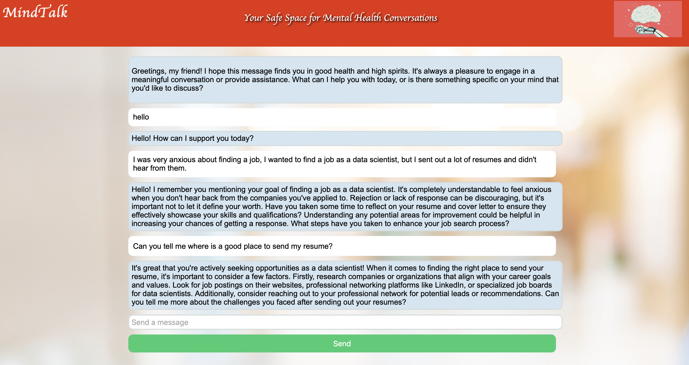

# Mental Health Intelligent Chatbot NLP Project

  

Welcome to the MindTalk Chatbot! This project is not just about offering support for mental health concerns; it's a gateway to leveraging cutting-edge Natural Language Processing (NLP) for analyzing complex issues related to AI ethics and justice. Our chatbot, powered by Python and the OpenAI API, provides a warm, confidential space where users can engage in meaningful conversations, access information, and seek assistance without fear of judgment. What sets MindTalk apart is its ability to store conversation data on Azure, allowing the chatbot to recall and provide continuity in user interactions, enabling a more holistic approach to addressing mental health and AI ethics.

Here's to a supportive, empathetic, and technologically advanced platform for discussing mental health and exploring the ever-evolving landscape of AI ethics. https://hongyizhan.github.io/Mental-Health-Intelligent-Chatbot/

## Table of Contents

- [Project Overview](#project-overview)
- [Getting Started](#getting-started)
- [Prerequisites](#prerequisites)
- [Contributing](#contributing)
- [Responsibility](#responsibility)

## Project Overview

Mental health is a critical and often stigmatized topic. This project aims to provide a safe and accessible platform for users to discuss their mental health concerns while also advancing the field of AI ethics through Natural Language Processing (NLP). The chatbot uses the OpenAI API to generate responses and interact with users in a natural and empathetic manner. 

## Getting Started

Follow these instructions to get the project up and running on your local machine.

### Prerequisites

Before you begin, make sure you have the following:

- Python 3.x installed for processing the web back-end 
- An OpenAI API key to generate responses
- An Azure account for conversation histor storage
- An User-friendly HTML web interface for chatting

### Innovative Workflow

The core innovation of our project lies in its workflow, which is meticulously crafted to provide a tailored and continuously evolving experience for our users:

1. **User Identification**: 
   - A user clicks on the chatbot link and is led to a login page.
   - The user enters a unique identifier assigned to them during the initial session.

  

2. **Engaging Conversation**: 
   - Once logged in, the user proceeds to the chat page to start a conversation with the chatbot.

  

3. **Data Retention**: 
   - After the initial chat session, the user finishes the conversation.

4. **Session Continuity**: 
   - When the user returns to the link after several days have passed, a repeatable session is initiated.
   - The user is led back to the login page and enters their unique identifier from the initial session.

5. **Personalized Experience**: 
   - Based on the identifier, the chatbot "remembers" the conversation from the past for that specific user.
   - The chatbot leverages this historical data to generate a new conversation, often with follow-up questions based on the prior chat.

## Contributing

This project was spearheaded by **Hongyi Zhan**, who dedicated his time and expertise to bring the MindTalk Chatbot to life. Hongyi's passion for technology, mental health, and AI ethics was a driving force behind this endeavor. 

Additionally, we are grateful for the valuable guidance and support provided by **Elizabeth Han**, Hongyi's supervisor. Her expertise and insights played a pivotal role in shaping the project's direction and ensuring its success.

This project is a result of the collaborative efforts and commitment of both Hongyi and Elizabeth, and we extend our appreciation to them for their contributions to this meaningful initiative.

We welcome contributions to improve and expand the functionality of the Mental Health Chatbot project. If you would like to contribute, please follow these steps:

1. Fork the repository.

2. Create a new branch for your feature or bug fix.

3. Make your changes and ensure that the code is well-documented.

4. Test your changes thoroughly.

5. Submit a pull request to the main repository.

6. Your pull request will be reviewed, and feedback will be provided.

## Responsibility

**Please Note:** The MindTalk Chatbot project is intended solely for academic research and educational purposes related to AI and mental health. It is not intended for or to be used in any commercial, business, or for-profit capacity at this time.

Users of this project are kindly requested to adhere to this principle of academic research and to refrain from using the chatbot or its components for any commercial or business purposes without prior explicit consent.

We are committed to fostering a collaborative academic environment where the focus is on advancing AI and mental health research. Your cooperation in maintaining this distinction is greatly appreciated.

For any inquiries or requests related to commercial or business use, please contact us [hongyi.zhan@mail.mcgill.ca](hongyi.zhan@mail.mcgill.ca) for further discussion and potential collaboration.

